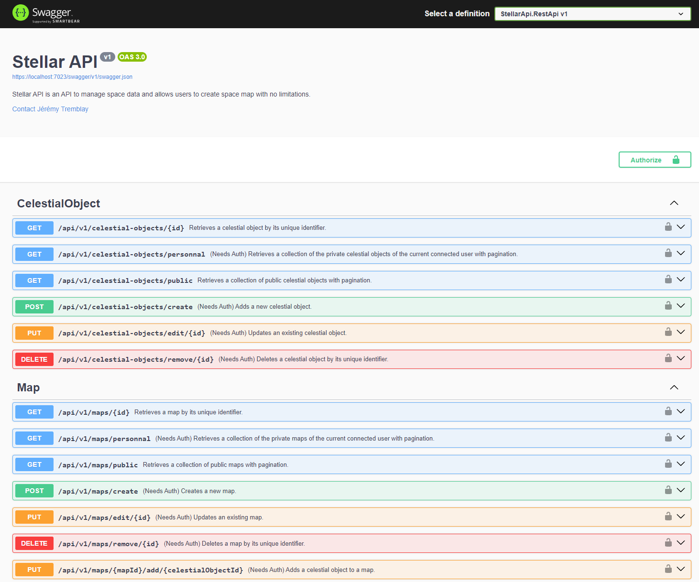

<h1 align="center"> 🌌🚀 Stellar API 🌠🌟 </h1>

Stellar API enables users to create, modify, and delete celestial objects like stars and planets, which can be added to maps for unique designs. Users can create accounts to start their own projects and share them publicly, fostering a collaborative and creative community around celestial visualization.

If you have a creative mind, this API is for you ! 🎨👩‍🎨👨‍🎨

## 🚀 Features

- [x] 🆔 Create your own account with your personal information and authenticate you to start using all the features.
- [x] From here, you will be able to:
  - [x] 🌟 Create, edit, delete and manage stars.
  - [x] 🌍 Create, edit, delete and manage planets.
  - [x] 🗺️ Create, edit, delete and manage maps.
  - [x] ...and more !
- [x] 🌐 Make your creations public or not if you want to let other see your work.

## 📱 Application

This simple API is used to manage and provide space data for various applications. Here you can see a visual of a part of the available routes of the API:

<p align="center">
    
</p>
<p align="center" text>
    <i>
        The current visual of the swagger with various routes that you can use to manage stars, planets, maps and users. More will come in the future. 🚀🌌
    </i>
</p>

This API may be used in many small projects to make a simple but working application or for search related works. 🕵️‍♀️🕵️‍♂️

## 💻 Languages and Technologies Used

- 🟦 [.NET Core 8](https://dotnet.microsoft.com/en-us/download/dotnet/8.0).
- 🟩 [Docker](https://www.docker.com/)
- 🟨 [Microsoft Azure](https://azure.microsoft.com/)

## 📚 Prerequisites

Currently the API is not completely deploy to Azure, so you must install the following tools below if you want to run it locally.

- [.NET Core 8](https://dotnet.microsoft.com/en-us/download/dotnet/8.0).
- [Visual Studio](https://visualstudio.microsoft.com/)
- [EF Core](https://learn.microsoft.com/en-us/ef/core/)

## 🏃‍♂️ How to Run the API

### Using the hosted solution with Azure

> 🚧 Currently, the API is available [here, hosted in Azure](https://stellar-api-web.azurewebsites.net/swagger/index.html), but it is not working. This problem will be solved soon, so waiting this fix, you can run it locally. 🛠️

### Locally With Docker

> 🚧 Currently, the Docker image is available online but it is not working as well because of the same problem. You can try it but will receive error response for requests that need to access the database.

You can install Docker and pull the last image and run it using the following commands:

```shell

# Pull the latest image deployed.
docker pull jeremytremblay2/stellar-api:latest

# Run the container on your local machine on the 8080 port.
docker run -d -p 8080:8080 jeremytremblay2/stellar-api:latest

```

After this, you can go on https://localhost:8080/swagger/index.html and will have an access to the swagger.

### Locally with compilation

1. 📥 Clone the repository.
2. 📁 Open the solution file under `src/StellarApi/StellarApi.sln` on Visual Studio or your prefer IDE.
3. 📦 Make sure you have Entity Framework installed (globally or not) on your computer, and then at the `src/StellarApi/` folder, run the following commands:

```shell

# Create the migration to prepare the database.
dotnet ef --startup-project .\StellarApi.RestApi\ --project .\StellarApi.Repository\ Migrations add Init --context SpaceDbContextSeed

# Update the database and prepare to start.
dotnet ef database update --startup-project .\StellarApi.RestApi\ --project StellarApi.Repository --context SpaceDbContextSeed

```

4. 🚀 You can build and run the solution, this will be executed locally. If you see a prompt appearing, please **trust** certificates or you will not able to run the project.
5. 🌟 The swagger will be available at the following address: https://localhost:7023/swagger/index.html. You can start creating an account and trying the routes.

## 📖 Documentation

You can find the API documentation on the `doc/` folder of this repository. 📚

A few class diagrams are present, some screenshots as well. 📸

## 🤝 How to Contribute

1. Fork the repository 🍴
2. Create a new branch with your feature 🌿
3. Commit your changes 💾
4. Push to your branch 🚀
5. Create a pull request 📬

If you need a connection string or something Azure or Docker related, please contact us. 📞

## 👥 Authors

**TREMBLAY Jérémy**

- Github: [@JeremyTremblay2](https://github.com/JeremyTremblay2)
- LinkedIn: [@Jérémy Tremlay](https://fr.linkedin.com/in/j%C3%A9r%C3%A9my-tremblay2)

**CROISIER Maxime**

- Github: [@Emixam309](https://github.com/Emixam309)
- LinkedIn: [@Maxime Croisier](https://www.linkedin.com/in/maxime-croisier-425131220/)

## 📝 License

We want to leave the possibility to other people to work on this project, to improve it and to make it grow, that's why we decided to place it under MIT license.

> Read more about the [MIT licence](https://opensource.org/licenses/MIT).

You can use it for a search project or just for your personnal use.  
If you use the Stellar API in your projects, please just cite our repository as follows:

```
@misc{stellarAPI2024,
author = {Jérémy Tremblay & Maxime Croisier},
title = {Stellar API: Manage and Visualize Celestial Objects},
year = {2024},
howpublished = {\url{https://github.com/JeremyTremblay2}},
note = {Version 1.0}
}
```
